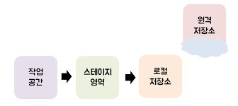
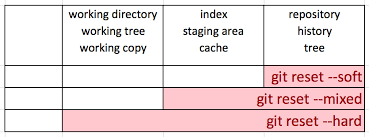
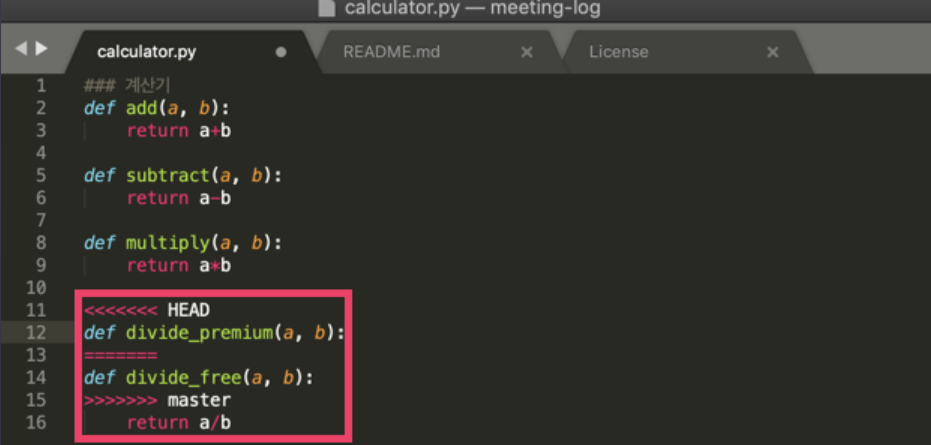

# GitHub 사용법

## GitBash 명령어
---

### > 처음 깃에 접속해서 간단하게 사용하는 명령어 모음 

 

* git config --global user.name "my name"
* git config --global user.email "my email"
* cat ~/.gitconfig
* ls 
> 사용자 이름과 이메일 설정을 하고 이를 확인하는 명령어입니다. ls 명령어는 현재 위치에서 볼 수 있는 파일들을 보여준다.

 

* mkdir "folder name"
>폴더를 생성한다. 

 

* cd "folder name"
* cd ../
* cd

>폴더로 이동 및 cd 혼자 사용할 경우 home 디렉토리로 이동하며 ../ 등의 상대 경로를 통해 이동이 가능하다.

 

* git init

> 깃을 생성하여 커밋이나 레포지스터에 올릴수 있는 Git 저장소로 변환해 줍니다.

 

### > 깃허브의 커밋 활용 명령어 및 개념

 

> commit : 커밋이라고 부르며 파일을 추가하거나 변경 내용을 저장소에 저장하는 작업

> push : 파일을 추가하거나 변경 내용을 remote repository에 업로드 하는 작업

 

    
    

 

우리가 일반적으로 사용하는 저장소는 그림에서는 작업 공간으로 표시가 되며, 이를 스테이지 영역에 올린 다음에 커밋을 하여 변경 사항을 저장한다. 

원격 저장소를 사용하는 이유는 사고의 방지와 협업의 편리성을 위해 사용합니다.

 

* git add "file or ."

> 우리가 만든 파일을 스테이지 영역에 올립니다. file 명만 적으면 파일하나가 올라가고 수정한 모든 파일을 스테이지 영역에 올리고 싶다면 git add . 을 사용하면 된다.

 

* git commit -m "something chaged"

> " "사이에 있는 메세지와 함께 스테이지 영역에 있는 파일들을 로컬 저장소에 저장합니다. 

 

* git log
* git log --pretty=oneline
> 커밋 히스토리를 출력해줍니다. 뒤에 --pretty=oneline을 사용할 경우 한줄로 이쁘게 출력 됩니다.

 

* git show "commit id"
> 특정 커밋에서 어떤 변경사항이 있었는지 확인해 줍니다. 

 

* git commit --amend
> 마지막으로 커밋한 내용을 수정하여 새로운 커밋으로 만듭니다.

 

* git config alias.별명 "커맨드"
> 길이가 긴 명령어에 별명을 붙여서 이후 별명으로 사용할 수 있도록 설정합니다.
> 예 ) git config alias.history log--pretty=online

 

* git diff[commit id.a][commit id.b]
> 두 커밋간의 비교를 시행합니다.
 

* git reset [option][commit_id]
  
  

    

 
 

> reset은 특정 커밋으로 되돌아 가는 명령어를 의미한다. 옵션 같은 경우 되돌아 갔을 때 어느 저장소까지 영향을 미치는지에 대해 확인 할 수 있으며 soft, mixed, hard 가 존재한다. 

 

* git tag "message" "id"
> 중요한 commit 내용이 있을 경우 tag를 이용하여 commit에 대한 정보를 달아 놓을 수가 있다. 

 

### > 깃허브의 브랜치의 개념과 명령어

 

> Branch : 브랜치란 가지라는 의미로 협업같은 것을 할 때, 한 가지의 버전으로 하는 경우는 잘 없다. 예를 들어 무료, 유료 프로그램을 만들고자 할 때, 유료는 무료 프로그램의 + a 기능을 추가한 것임으로 분기점을 나누어 개발하는 것이 편리 하기 때문에 브랜치라는 개념을 도입했다. 

 

* git branch
* git branch "branch name"
* git branch -d "branch name"
  
> 현재 브랜치들을 보여주며, 현재 자신의 브랜치 상황을 알려주는 명령어 이다. 뒤에 브랜치 이름을 적으면 브랜치를 하나 생성한다. -d 를 삽입할 경우 해당 브랜치를 삭제 한다.

 

* git checkout "branch name"
> 해당 브랜치로 이동하는 명령어 이다.

 

* git checkout -b "branch name"
> 브랜치 하나를 생성하면서 바로 그 브랜치로 이동하는 명령어 이다.

 

* git merge "branch name"
> 현재 있는 브랜치 위에서 merge 하고 싶은 브랜치를 합병하는 명령어 입니다. 브랜치를 합병 할 때, conflict(충돌)을 조심 해야 합니다. 충돌을 없애는 방법은 중복되는 요소의 파일을 열어 수정해주면 됩니다.

  

    

 
 

* git merge--abort
> 하지만 merge 자체를 취소 하고 싶은 경우에는 merge--abort 명령어를 사용하여 본 브랜치로 돌아갈 수 있습니다. 

 

* git remote add origin https://github.com/kyuri-dev/Math_Box.git
> remote 는 리모트 레포지토리 관리할때 사용하는 커맨드 이다. 그 뒤에 add 는 새로운 레포지토리를 등록하겠다라는 의미이다. 첫 번째 명령어는 https://github.com/kyuri-dev/Math_Box.git 를 origin 이라는 이름으로 등록 하겠다라는 뜻을 의미합니다. 

 

* git push -u origin master
> 현재 로컬 레포지토리에 있는 master 브랜치의 내용을 origin 이라는 리모트 레포지토리로 보낸다는 의미의 명령어 입니다. 만약 origin 리모트 레포지토리에 브랜치가 없다면 master 브랜치를 생성하고 푸쉬합니다.
 
> 따라서 로컬에서의 브랜치와 리모트 레포지토리의 브랜치를 master 와 origin/master로 구분 할 수 있습니다. 

 

### > 실무 상황에서의 대처법

 

* git pull
> 일반적으로 push를 하기전에 pull로 리모트 레포지토리에 있는 내용을 가져와서 push 하는 것을 추천한다. 만약에 서로 겹치는 상황이 있을 경우에는 conflict 가 뜸으로 이를 적절히 수정하여 대처하면 된다.

 

* git fetch
* git diif [branch1][branch2]
> 만약에 다른 사람이 올린 것을 pull로 당겨올 경우가 존재 할 수 있다. 따라서 이것을 대처 하기 위해서는 fetch를 활용한다. fetch 는 가져온 변경 내용을  로컬에 영향을 미치지 않기 때문에 병합전에 확인하는 과정으로 사용하는것이 좋다. 

 

>" pull 과 fetch의 차이는 pull은 가져온 내용을 머지하지만 fetch는 내용을 가져오기만 한다. "

 

* git blame "file_name"
* git show "fileid"
> 누가 코드를 어느 커밋에서 수정했는지 알 수 있다. 이를 할용하여 git show를 이용하면 코드의 작성자를 찾을 수 있다.

 

* git revert "commit id"
> 전에 있던 커밋으로 돌아가는데 이는 리모트 레포지토리로 푸쉬 된 커밋을 취소 하고 싶을 때 사용한다. reset을 사용하여 하면 되지 않을까? 라는 생각을 가지지만 가리키는 브랜치의 차이가 생겨버리기 때문에, push를 할 수가 없어져서 revert 명령어를 사용한다. 

 

* git rebase "branch"
> 성능은 merge와 같으나 히스토리에서의 차이를 보인다. merge 같은 경우 두개의 새로운 브랜치가 생겨서 합쳐지는 그래프를 보여주나, rebase를 사용하면 하나의 브랜치에서 덧붙여서 커밋되는 것 처럼 그래프를 보여준다. 만약 브랜치 머지를 보여줘야하는 상황이면 merge를 그게아니면 rebase를 사용하는 것이 좋다.

 

* git stash
* git stash list
* git stash apply "id"
* git stash drop "id"
> 만약 작업을 하다가 다른 브랜치로 이동해야 할 경우에 커밋을 남기지 않고 임시저장을 해야하는 경우가 생기는데 그 때 사용한다. stash 한 내용은 stack에 쌓이며 list 명령어를 활용하여 확인할 수 있다. 이를 다시 가져와야 하는 경우가 생기면 apply "id" 를 활용하여 작업 했던 내용을 다시 가져온다. 스택에 쌓인 임시저장 내용을 삭제하려고 한다면 drop "id" 명령어를 활용하면 해당 내용이 스택에서 삭제된다.

 

* git cherry-pick "id"
> 커밋한 내용 중에서 필요한 커밋의 내용만 가져올 수 있다.

