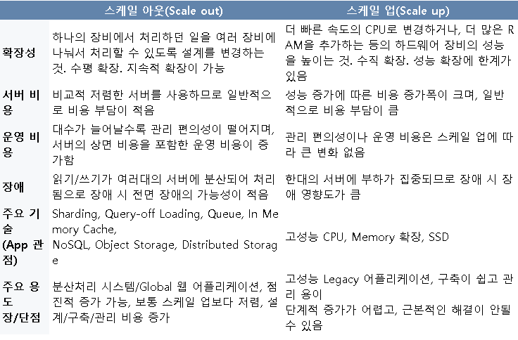
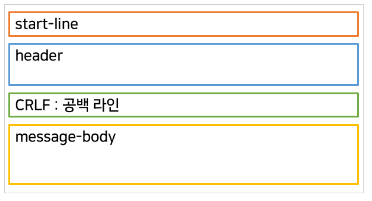

# HTTP

## 1. HTTP란?

 

>Http는 (HyperText Transfer Protocol) 의 약자로 인터넷에서 데이터를 주고 받을 수 있는 프로토콜을 의미합니다. 

>Protocol 이란 규칙 (약속) 이라는 의미로 컴퓨터 네트워크에서 데이터를 주고 받을때, 이러한 규칙에 맞춰 개발함으로써 서로 정보를 교환할 수 있게 하는 것입니다. 

 

예를 들어서 웹 문서를 주고 받을 때에는 HTTP 를 사용하여야 하고 파일을 주고 받을 때에는 FTP, 메일을 주고 받을때에는 SMTP. POP 등의 전송 계층과 유형에 따라 다양하게 사용됩니다. 

 

## 2. HTTP 의 동작

 

> HTTP는 클라이언트 즉, 사용자가 브라우저를 통해서 어떠한 서비스를 URL을 통해서 요청 (Request)를 하면 서버에서 해당 요청사앙에 맞는 결과를 찾아서 사용자에게 응답 (Reponse) 하는 형태로 동작한다. 

 

    

 

## 3. HTTP 특징

 

>1 . 클라이언트 서버 구조   
>2 . 무상태 프로토콜 (Stateless)   
>3 . 비 연결성 (Connectionless)   
>4 . HTTP 메세지

 

## 3.1. 클라이언트 서버 구조

 

>HTTP는 클라이언트가 서버에 요청을 보내면 서버는 그에 대한 응답을 보내는 클라이언트 - 서버 구조로 이루어져 있다.

 

    

 

>Request - Response 구조라고도 하며 클라이언트는 서버에 요청을 보내고 응답을 대기하며, 서버는 요청에 대한 결과를 만들어 응답한다.

 

## 3.2. 무상태 프로토콜 (Stateless)

 

> HTTP에서 서버가 클라이언트의 상태를 보존하지 않는 무상태 프로토콜 이다.

 

    

 

> 이로 인해서, 서버의 확장성 (Scale Out) 이 높다는 장점이 있으나, 클라이언트가 추가 데이터를 전송해야한다는 단점이 있다.

 

* 스케일 아웃 (Scale Out) vs 스케일 업 (Scale Up) 의 차이

 

    

 

## 3.3. 비 연결성 (Connectionless)

 

>클라이언트와 서버가 한 번 연결을 맺은 후, 클라이언트 요청에 대해 서버가 응답을 마치면 맺었던 연결을 끊어버리는 특성을 가진다. 이로 인해 서버에서 다수의 클라이언트와 연결을 계속하지 않기에 그에 따른 리소스의 부담을 줄이고, 그것을 활용하여 더 많은 연결을 할 수 있는 장점을 가진다.

 

## 3.4. HTTP 메세지

 

>HTTP 메세지란 클라이언트와 서버 사이에서 데이터가 교환되는 방식을 의미한다.
2가지의 유형이 존재하는데 하나는 요청 (Request) 이며 다른 하나는 응답 (Response) 이다.

 

## 3.4.1 HTTP 메세지 구성

 

> HTTP 메세지는 몇 줄의 텍스트 정보로 구성되어 있으며, 구성파일, API, 기타 인터페이스에서 HTTP 메세지를 자동으로 완성한다.

 

    

 

>1 . Start line : 요청이나 응답의 상태를 나타내고, 항상 첫 번째 줄에 위치한다. 응답에서는 status line 이라고 부른다.

>2 . Http headers : 요청을 지정하거나, 메세지에 포함된 본문을 설명하는 헤더의 집합 이다.

>3 . empty line : 헤더와 본문을 구분하는 빈 줄

>4 . body : 요청과 관련된 데이터나 응답과 관련된 데이터 또는 문서를 포함한다. 요청과 응답의 유형에 따라 선택적으로 사용 한다.

* Start line 과 Http headers 를 묶어 요청이나 응답의 헤드 (head) 라고 이야기 한다. 

 

## 3.4.2 요청 (Request)

 

    

 

> Start line (Request line) : Http request의 첫 라인으로써, Http Method, Request target, Http Version 으로 3부분으로 구성된다.

> HTTP Method 는 HTTP Verbs 라고도 불리며, Get, Post, Put, Delete 등의 여러 Method 들을 가지고 있다.

 

## 3.4.3 응답 (Reponse)

 

    

 

> Status line : response의 상태를 간략하게 나타내며, Http Version, Status code, status text 으로 3부분으로 구성된다.

> Status code 는 서버가 클라이언트에게 응답의 상태를 알리는 수단이다. 크게 다섯가지의 클래스로 분류 된다.

 

    

 

* 1xx: 요청 정보 처리중(Informational)
* 2xx: 요청을 정상적으로 처리(Success)
* 3xx: 요청을 완료하기 위해 추가 수행 필요(Redirection)
* 4xx: 요청한 자원이 서버에 존재하지 않음(Client Error)
* 5xx: 서버가 요청 처리 실패(Server Error)

 
 

참고 사이트 :
* https://hanamon.kr/%EB%84%A4%ED%8A%B8%EC%9B%8C%ED%81%AC-http-http%EB%9E%80-%ED%8A%B9%EC%A7%95-%EB%AC%B4%EC%83%81%ED%83%9C-%EB%B9%84%EC%97%B0%EA%B2%B0%EC%84%B1/
* https://m.blog.naver.com/islove8587/220548900044
* https://hanamon.kr/%EB%84%A4%ED%8A%B8%EC%9B%8C%ED%81%AC-http-%EB%A9%94%EC%84%B8%EC%A7%80-message-%EC%9A%94%EC%B2%AD%EA%B3%BC-%EC%9D%91%EB%8B%B5-%EA%B5%AC%EC%A1%B0/
* https://girawhale.tistory.com/65
